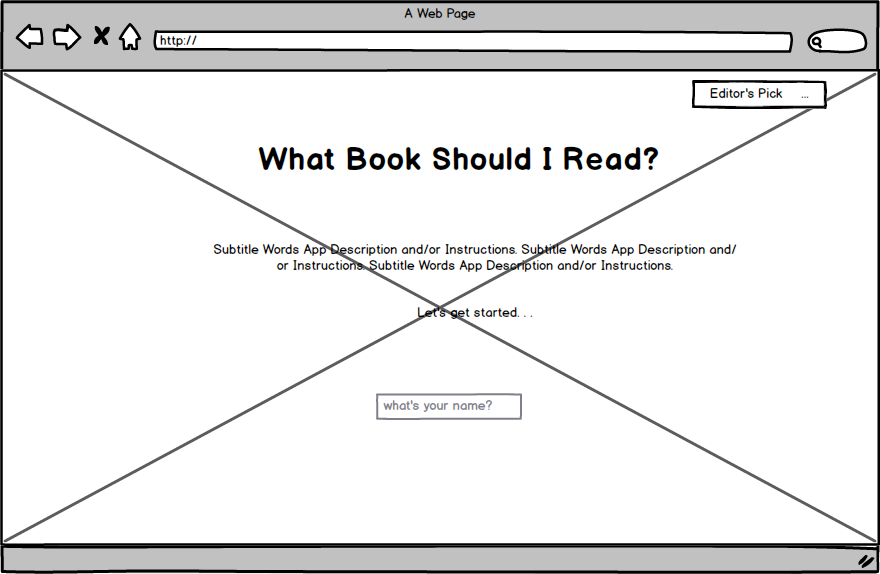
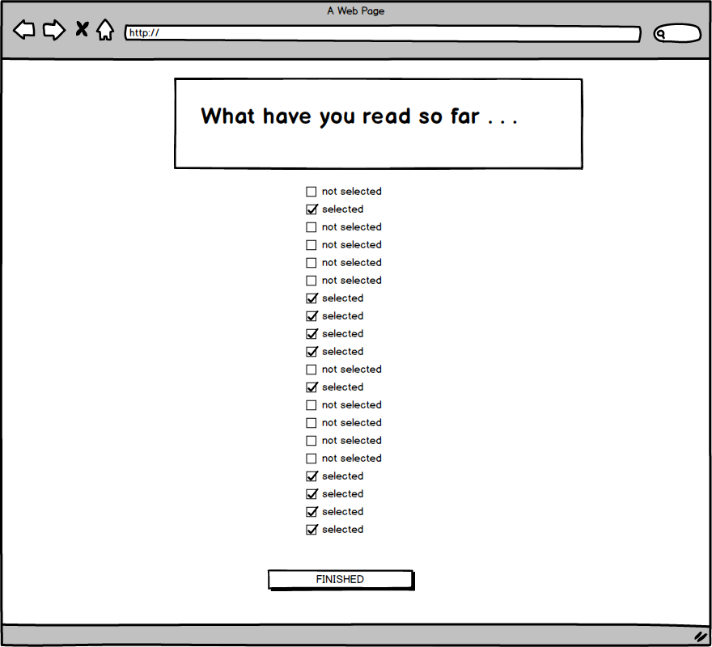
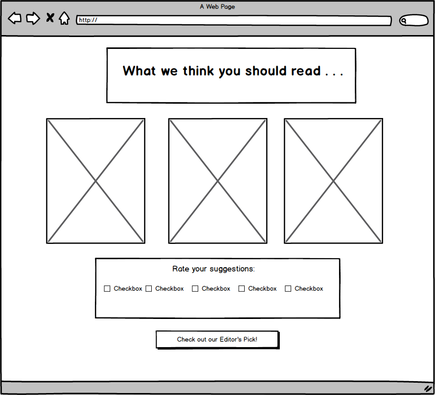
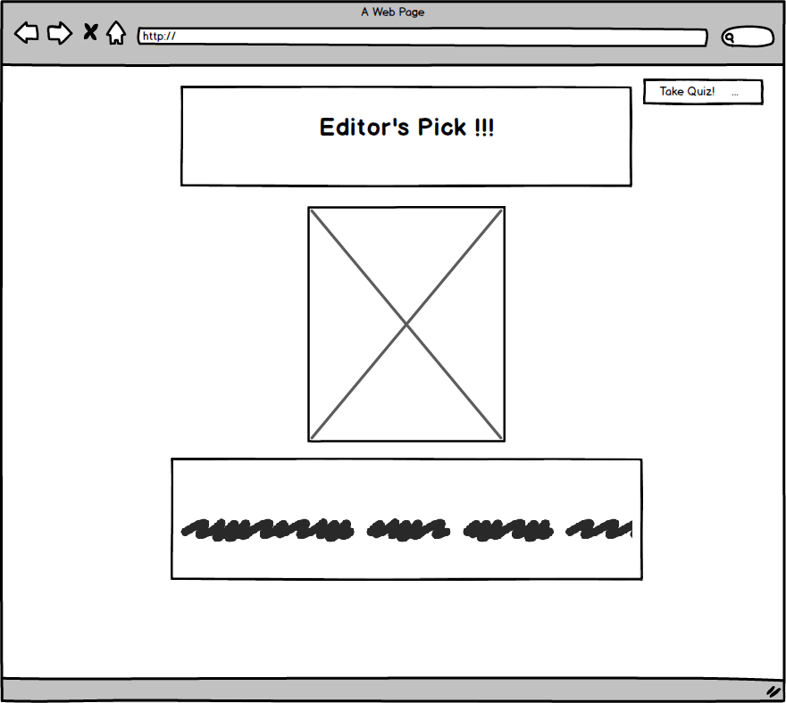
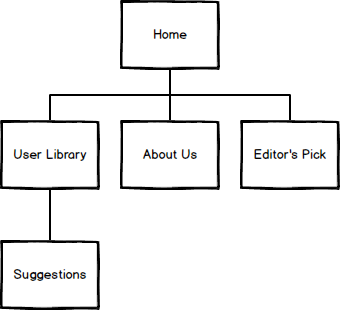

# What Should I Read (working title)

## Overview

'What Should I Read' is a web app designed to reduce the stress of having to figure out what book one should read next. Having so many choices and limited time, 'What Should I Read' aims to provide quick suggestions from curated lists -- By doing so we not only make the choosing process easier but we also guarantee that the recommendations are books worth reading!

The way the app works is that it uses past user reading history (from a concise list) in order to recommend options that fit their reading patters. We also offer the ability to refine preferences to provide new insights on what you might want to read. And if the user is feeling advenrtures, we also offer an Editor's Pick option to immediately have a suggestion!


## Data Model

Minimally, we'll have to store Users, Libraries and Books

* users have two lists: a User-Library and a Reading-List
* each list has multiple Book items
* admins also have a library which is collection of lists of books

First draft schema:

```javascript
// users
// * our site requires authentication for specific users (admin)...
// * they also can have 2 lists
var User = new mongoose.Schema({
  // username, password for admin provided by plugin  
  name: {type: String, required: true},
  reading-list:  [{ type: mongoose.Schema.Types.ObjectId, ref: 'Book' }],
  user-library:  [{ type: mongoose.Schema.Types.ObjectId, ref: 'Book' }],
  admin-library:  [{ type: mongoose.Schema.Types.ObjectId, ref: 'Library' }]
});

// books
// * includes title, author, genre, and a unique score (used to generate recommendations)
// * title might change and or include ispn
var Book = new mongoose.Schema({
	title: {type: String, required: true},
    genre: {type: String, required: true},
    author: {type: String, required: true},
	score: {type: Number, required: true},
});

// libraries - used initially to store curated libraries
// * each library must have a related user
// * a list can have 0 or more items
var Library = new mongoose.Schema({
    user: {type: mongoose.Schema.Types.ObjectId, ref:'User'},
    name: {type: String, required: true},
	books: [Book],
    checked: {type: Boolean, default: false, required: true}
});
```

## Wireframes






## Sitemap



## User Stories

* As a user, I want a simple book recommendation so that I can figure out what to read.
* As a user, I want a more personal book recommendaion so that I can figure out what to read.
* As an admin-user, I want to populate the site database so that I can provide a curated book list.

## Reserach Topics

* (3 points) Integrate user authentication
    * I'm going to be using Passport for user authentication
    * User authentication is used grant access/permission to certain users by matching their inputted credentials with those existing in a database
    * Passport...authenticates requests (based on app authentication requirements) while delegating all other functionality to the application.
* (3 points)  Automated functional testing 
    * I'm going to be looking into Selenium, Mocha, and Chai as references in this <a href="http://bites.goodeggs.com/posts/selenium-webdriver-nodejs-tutorial/">tutorial</a>
    * Selenium is a suite of tools used to automate web browers across various platforms.
* (1 points) Use a CSS framework throughout your site
    * I will be using Bootstrap
    * CSS frameworks provide generic css functionality to make web-design easier more and more standards-compliant
    * Bootstrap is a popular front-end framework used for faster and easier web development.
* (2 points) external API (maybe)
    * I might use GoodReads api (more research has to be done on how to integrate to project goals.)
    * External apis (application programming interfaces) are essentially libraries that allow for applications to integrate functionalities
    * GoodReads API provides access to their book and user database which would facilitate the presentation aspect of the recommendation.

